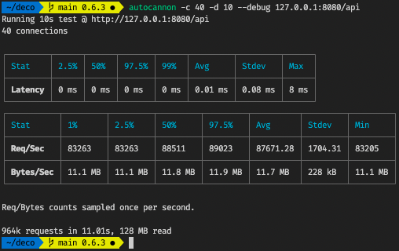

[](https://doc.deno.land/https/deno.land/x/deco/mod.ts)

# Deco is a utility library for [Deno](https://deno.land) developers

- Fault tolerance helpers (@Timeout, @Retry, @Try, @Trace, @Debounce, @Throttle,
  @RateLimit, @Concurrecy, @Cache)
- REST @Http API helpers with OpenAPI and EventStream support
- @Dapr helpers (Service, PubSub, Bindings, State, Secrets, Actor) for resilient
  cloud native Deno microservices/actors

## Minimal Http server example

```typescript
// curl localhost:8080/hello
class ServerController {
  @HttpServer.Get()
  hello() {}
}

HttpServer.serve({
  controllers: [ServerController],
});
```

## Running tests

```sh
deno test --unstable --allow-all --coverage=cov_profile
deno coverage cov_profile

cover cache.decorator.ts ... 100.000% (25/25)
cover concurrency.decorator.ts ... 100.000% (23/23)
cover httpserver.decorator.ts ... 97.845% (227/232)
cover ratelimit.decorator.ts ... 100.000% (26/26)
cover timeout.decorator.ts ... 100.000% (36/36)
cover HttpRouter.ts ... 100.000% (41/41)
cover utils.ts ... 100.000% (70/70)
```

## Http server performance, static route (~125k RPS on MBP/M1)




